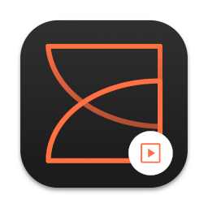

<div align="center">

<h1>ZeppPlayer</h1>
<p>Unofficial ZeppOS emulator.</p>
</div>

This application can run ZeppOS apps & watchfaces in your browser. Useful for 
homebrew development, faster and more flexible than the official ZeppOS 
Simulator, but a bit less compatible.

- [💿 Binary download](https://mmk.pw/en/zepp_player/)
- [❤️ Make a donation](https://mmk.pw/en/donate)

⚠️ Main ZeppOS device, which is used as prototype of emulation, is Xiaomi Mi Band 7.
So work of any other isn't guaranteed for now.

---

## Features
- Preview ZeppOS apps and watch faces into browser
- Faster than official simulator, easier to install
- State editor: set custom time, date, activity, etc. values for preview
- Watchface GIF generation
- Ability to use Chrome debugger to debug your watchface/application
- Already converted (TGA) images support

Limitations:
- ZeppPlayer can't run watchface/app with bytecode-compiled JavaScript sources (eg `app.bin`/`index.bin` files)
- **May work buggy in Firefox**
- No support of `side-service` and `settings-app` APIs, only ZeppOS device behaviour is implemented
- Not full compatability with ZeppOS APIs

Currently supported ZeppOS devices: all.

## Installation and basic usage

Grab binary build [here](https://mmk.pw/en/zepp_player/) or build your own one, and
run application. Your browser will be opened automatically.

Now, just unpack your ZeppOS app/watchface archive into `projects` folder near player,
refresh page, and you'll see them into project picker in top-left of application. If you
can't write files into that folder, or can't find them, you can change projects location
from application.

### ArchLinux
You can build & install ZeppPlayer with AUR script: `yay -S zeppplayer`.

## Build from sources

### Linux
Recommendations:
- Connect [NodeSource repository](https://github.com/nodesource/distributions) to get fresh nodejs

Install dependencies, for Debian\Ubuntu:

```bash
apt install nodejs python3 python3-pip make python3-venv python3-gi python3-requests python3-tk \
    python3-pil libgtk-3-0 gir1.2-appindicator3-0.1 gir1.2-ayatanaappindicator3-0.1

# NodeJS dependencies
npm i
```

Then, select one of options bellow

#### Option 1. Make and install debian package (for Ubuntu/Debian)
You also must install `debcompat-helper build-essentials` packages.

```bash
dpkg-buildpackage -b
sudo dpkg -i ../zeppplayer*.deb # Install (optional)
```

#### Option 2. Make and install
Most common installation way.

```bash
make
make install # Install (optional)
```

After that, you'll be able to find player in apps menu.

#### Option 3. Run directly from source code
️⚠️ Not recommended for common use, requires too much disk space. Better to use some package manager
or make/make install.

Just run `./start.sh` in that folder.

### Windows (10-11)
Dependencies:
- NodeJS 16+
- Python 3.10+
- [A lot of dependencies for node-canvas](https://github.com/Automattic/node-canvas/wiki/Installation:-Windows)
- (optional) [the Ultimate Packer for eXecutables](https://upx.github.io/) (to reduce output binary size)

If you have [Chocolatey](https://chocolatey.org/), you can install all of them with one
PowerShell command (run as administrator):

```powershell
choco install visualstudio2022buildtools visualstudio2022-workload-vctools `
  python311 upx nodejs gtk-runtime libjpeg-turbo
```

Build progress. All commands written in PowerShell syntax, Python version 3.11 is used:

1. Grab sources from here, open PowerShell in this folder
2. Install NodeJS dependencies: `npm i`
3. Create virtualenv: `python3.11 -m venv`
4. Activate virtualenv: `.\venv\Scripts\activate`
5. Install Python dependencies: `pip install -r requirements.txt`
6. Try to build a binary package with script: `python make_release.py`
7. Output binary will appear in `dist` folder

### macOS (11+)
Install a pack of dependencies from homebrew:
```bash
brew install pkg-config cairo pango libpng jpeg giflib librsvg node python@3.11 python-tk@3.11 upx
```

Build progress.

1. Grab sources from here, open terminal in this folder
2. Install NodeJS dependencies: `npm i`
3. Create virtualenv: `python3.11 -m venv`
4. Activate virtualenv: `source venv/bin/activate`
5. Install Python dependencies: `pip install -r requirements.txt`
6. Try to build a binary package with script: `python make_release.py`
7. Output binary will appear in `dist` folder

### Build via Vagrant virtual machines
⚠️ This build method is mostly useful only for publishing of new releases, but you can also
try them if no one of above works on your OS.

⚠️ Build for all platforms at one **requires a lot of RAM**, est. 6 GB should be free

You'll need to install [Vagrant](https://developer.hashicorp.com/vagrant) and VirtualBox.
Then, grab this sources and open shell into `tools` directory. Then, do `vagrant up` to build
for all platforms, or `vagrant up make_macos|make_win32|make_debian` to make for one only.

If you want to automatically halt machines after build, use `vg_auto_halt=true` env parameter,
example: `vg_auto_halt=true vagrant up`

After processing, build binaries will appear in `tools/output` folder. You could open 
VirtualBox manager to access created machines and test binaries, if needed.
Didn't forget to stop all of them (`vagrant halt`), or remove them to free disk space
(`vagrant destroy -f`).

## Contributors
- MelianMiko: Main developer
- [Игорь Худяков](https://4pda.to/forum/index.php?showuser=5434953): Better SmartBnad7 overlay mask

## License
    ZeppPlayer - ZeppOS simulator
    Copyright (C) 2022-2023 MelianMiko

    This program is free software: you can redistribute it and/or modify
    it under the terms of the GNU General Public License as published by
    the Free Software Foundation, either version 3 of the License, or
    (at your option) any later version.

    This program is distributed in the hope that it will be useful,
    but WITHOUT ANY WARRANTY; without even the implied warranty of
    MERCHANTABILITY or FITNESS FOR A PARTICULAR PURPOSE.  See the
    GNU General Public License for more details.

    You should have received a copy of the GNU General Public License
    along with this program.  If not, see <https://www.gnu.org/licenses/>.
